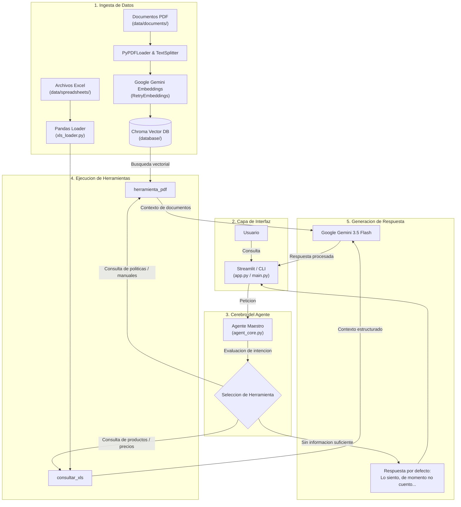

# Asistente Virtual Mercado - Sistema Agente RAG

## Descripción General del Proyecto

El proyecto Asistente Virtual Mercado es una solución basada en Inteligencia Artificial diseñada para optimizar la consulta y gestión de información operativa de un supermercado (Mercado Central 24h). El sistema permite interactuar en lenguaje natural para obtener respuestas precisas sobre inventarios, precios y stock de productos, así como sobre normativas de la empresa, reglamentos internos, manuales de proveedores y políticas de atención al cliente.

La solución integra capacidades de generación aumentada por recuperación (RAG, por sus siglas en inglés) y herramientas de análisis de datos estructurados en tiempo real. Además, ofrece dos entornos de interacción: una interfaz gráfica interactiva construida en Streamlit y un ejecutor por consola para pruebas directas en línea de comandos.

## Arquitectura de la Solución Implementada

La solución adopta una arquitectura modular basada en el patrón RAG y la orquestación de agentes mediante herramientas (Tool Calling).

### Diagrama del Flujo de la Arquitectura

### Flujo de Acciones y Componentes

1. Módulo de Carga e Ingesta de Datos (Data Loaders):
   - Carga de Documentos No Estructurados (PDF): El módulo `src/loaders/pdf_loader.py` procesa los manuales, políticas y reglamentos ubicados en la carpeta `data/documents/`. Los archivos son leídos con PyPDFLoader y fragmentados mediante `RecursiveCharacterTextSplitter` (tamaño de fragmento de 1000 caracteres con un traslape de 200). Posteriormente, se generan embeddings a través del modelo de Google Gemini y se persisten en una base de datos vectorial Chroma DB ubicada en `database/`.
   - Control de Cuotas (RetryEmbeddings): Para garantizar la resiliencia en la generación de vectores frente a límites de tasa de la API de Gemini (errores HTTP 429), se implementa un mecanismo de reintento exponencial con tiempos de espera progresivos.
   - Carga de Datos Estructurados (Excel): El módulo `src/loaders/xls_loader.py` inspecciona y lee la hoja de cálculo de inventario `.xlsx` ubicada en `data/spreadsheets/` mediante Pandas, estructurando los datos para su procesamiento por el agente.

2. Herramientas del Agente (Agent Tools):
   - `consultar_xls`: Herramienta encargada de analizar la tabla de inventario, permitiendo responder con exactitud sobre precios, productos y disponibilidad en stock.
   - `herramienta_pdf`: Herramienta encargada de realizar búsquedas de similitud vectorial en Chroma DB para recuperar contextos normativos de los manuales y políticas almacenados.

3. Cerebro y Orquestación del Agente (Agent Core):
   - Definido en `src/agent/agent_core.py`, utiliza `create_tool_calling_agent` y `AgentExecutor` de LangChain.
   - Recibe la consulta del usuario y decide dinámicamente si debe ejecutar una búsqueda vectorial, una consulta de tabla o responder de forma directa.
   - Implementa una regla estricta de control de alucinaciones: si la información requerida no está presente en los documentos o la hoja de cálculo, el agente responde textualmente: "Lo siento, de momento no cuento con esa información en mi base de conocimiento."

4. Capa de Presentación:
   - Interfaz Web (`app.py`): Desarrollada con Streamlit, ofrece un historial de chat dinámico, una barra lateral personalizada con el listado de archivos cargados en el sistema y una interfaz de usuario optimizada.
   - Interfaz de Consola (`main.py`): Permite la interacción directa con el agente desde la terminal.

## Tecnologías y Herramientas Utilizadas

- Lenguaje de Programación: Python 3.10+
- Framework de Orquestación de IA: LangChain (langchain-core, langchain-classic, langchain-community, langchain-google-genai, langchain-text-splitters)
- Modelos de Inteligencia Artificial (Google Gemini):
  - Modelo de Lenguaje Principal (LLM): gemini-3.5-flash
  - Modelo de Embeddings: models/gemini-embedding-001
- Base de Datos Vectorial: Chroma DB (chromadb / Chroma)
- Procesamiento de Datos:
  - Pandas y OpenPyXL para lectura y manipulación de archivos Excel (.xlsx)
  - PyPDFLoader para lectura e ingesta de documentos PDF
- Interfaz Gráfica de Usuario: Streamlit
- Gestión de Variables de Entorno: python-dotenv

## Instrucciones para Ejecutar el Proyecto

### 1. Requisitos Previos
Asegúrese de contar con Python 3.10 o superior instalado en el sistema, así como con una clave API válida de Google Gemini (GEMINI_API_KEY).

### 2. Configuración del Entorno
1. Abra una terminal en la carpeta raíz del proyecto.
2. Cree y active un entorno virtual de Python:
   - En Windows (PowerShell):
     python -m venv .venv
     .\.venv\Scripts\Activate.ps1
   - En Linux / macOS:
     python3 -m venv .venv
     source .venv/bin/activate
3. Instale las dependencias del proyecto ejecutando:
   pip install -r requirements.txt

### 3. Configuración de Variables de Entorno
Cree un archivo `.env` en la raíz del proyecto con el siguiente contenido:
GEMINI_API_KEY=tu_clave_api_aquí

### 4. Verificación de Fuentes de Datos
Asegúrese de que los archivos de soporte estén ubicados en las siguientes rutas:
- `data/documents/`: Archivos PDF con políticas, reglamentos y manuales.
- `data/spreadsheets/`: Archivo Excel (.xlsx) con los datos de inventario.

### 5. Ejecución de la Aplicación Web (Streamlit)
Para iniciar la interfaz interactiva en el navegador, ejecute:
streamlit run app.py

### 6. Ejecución en Modo Consola (CLI)
Para interactuar con el agente directamente desde la línea de comandos, ejecute:
python main.py

## Ejemplos de Preguntas que el Agente puede Responder

El agente está capacitado para responder consultas pertenecientes a las siguientes categorías:

### 1. Consultas sobre Inventario y Productos (Hoja de cálculo Excel)
- ¿Cuál es el precio del kilo de manzana roja y cuántas unidades quedan en stock?
- Mencióname los productos disponibles en la categoría de lácteos y sus precios.
- ¿Cuál es el producto con el precio más alto registrado en el inventario?

### 2. Consultas sobre Políticas y Normativas (Documentos PDF)
- ¿Cuál es el procedimiento para solicitar la devolución de un producto defectuoso?
- ¿Cuáles son los horarios y requisitos para la recepción de mercancía por parte de los proveedores?
- ¿Qué reglas establece el reglamento interno respecto al uso del uniforme de trabajo?

### 3. Consultas Fuera del Alcance del Sistema
- ¿Quién ganó el torneo mundial de fútbol en 2022?
- ¿Cómo estará el clima mañana en la ciudad?

## Ejemplos de Respuestas Generadas por el Agente

### Ejemplo 1: Consulta de Inventario (Excel)
Pregunta del usuario:
¿Cuál es el precio del kilo de manzana roja y cuántas unidades quedan en stock?

Respuesta del agente:
El precio del kilo de manzana roja es de $45.00 MXN y actualmente se cuenta con un stock de 120 unidades en inventario.

---

### Ejemplo 2: Consulta Normativa (PDF)
Pregunta del usuario:
¿Cuál es el plazo máximo para realizar la devolución de un producto?

Respuesta del agente:
De acuerdo con la Política de Atención al Cliente y Devoluciones, el cliente dispone de un plazo máximo de 30 días naturales a partir de la fecha de compra para realizar la devolución de productos no perecederos, presentando el ticket de compra correspondiente.

---

### Ejemplo 3: Consulta Fuera de Alcance
Pregunta del usuario:
¿Quién ganó el torneo mundial de fútbol en 2022?

Respuesta del agente:
Lo siento, de momento no cuento con esa información en mi base de conocimiento.
